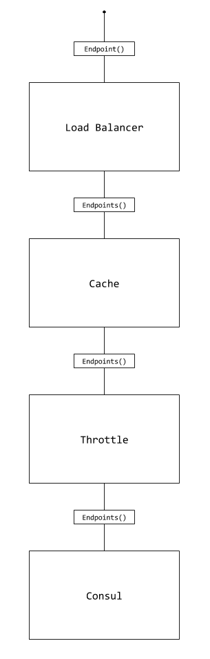

# Kit - Service Discovery [](https://ci.appveyor.com/project/chatham/kit-servicediscovery/branch/master)

Kit is a .NET Core toolkit for microservices that is heavily inspired by [go-kit](https://gokit.io/). The goal of Kit is to provide a common set of abstractions for platform components of a microservice framework.

The Service Discovery packages provide a set of abstractions for pluggable service discovery into the toolkit.

## Status

This project is still in development and subject to change.  Please create an issue with any feedback.

## Packages

* [Abstractions](src/Chatham.Kit.ServiceDiscovery.Abstractions) - Common abstractions for service discovery

### Supported Providers
* [Consul](src/Chatham.Kit.ServiceDiscovery.Consul) - A [consul](https://www.consul.io/) service discovery provider
* [Fixed](src/Chatham.Kit.ServiceDiscovery.Fixed) - A fixed list of endpoints provider

### Helpers
* [Cache](src/Chatham.Kit.ServiceDiscovery.Cache) - A caching discovery provider that can be chained with other discovery providers
* [LoadBalancer](src/Chatham.Kit.ServiceDiscovery.LoadBalancer) - Add load balancing algorithms to service discovery providers
* [Multi](src/Chatham.Kit.ServiceDiscovery.Multi) - Add multiple providers and returns the first provider with endpoints
* [Throttle](src/Chatham.Kit.ServiceDiscovery.Throttle) - A throttling discovery provider that can be chained with other discovery providers

## Example

A full working example can be found in the [samples](samples/) directory.  

### Simple
All requests for endpoints will request directly against the Consul api.

```csharp
var consulClient = new ConsulClient();
var subscriber = new ConsulServiceSubscriber(client, "FooService", new List<string>(), true, false);

var endpoints = subscriber.Endpoints();
```

### Caching
Since the Consul api supports long polling, we can cache the results and provide a background process to poll for changes.

```csharp
var consulClient = new ConsulClient();
var subscriber = new ConsulServiceSubscriber(client, "FooService", new List<string>(), true, true);

var cache = new MemoryCache(new MemoryCacheOptions());
var loggerFactory = new LoggerFactory();
var pollingSubscriber = new CacheServiceSubscriber(loggerFactory, subscriber, cache);

var endpoints = pollingSubscriber.Endpoints();
```

### Caching and Throttling
The caching implementation in combination with the throttle implementation can be used for any service discovery platform that does not support long polling.  The throttler is useful also to prevent overloading your service discovery platform with requests.

```csharp
var consulClient = new ConsulClient();
var subscriber = new ConsulServiceSubscriber(client, "FooService", new List<string>(), true, true);

// Limit to 5 requests per 10 seconds
var throttleSubscriber = new ThrottleServiceSubscriber(subscriber, 5, TimeSpan.FromSeconds(10))

var loggerFactory = new LoggerFactory();
var cache = new MemoryCache(new MemoryCacheOptions());
var pollingSubscriber = new CacheServiceSubscriber(throttleSubscriber, loggerFactory, cache);

var endpoints = pollingSubscriber.Endpoints();
```

#### Diagram


